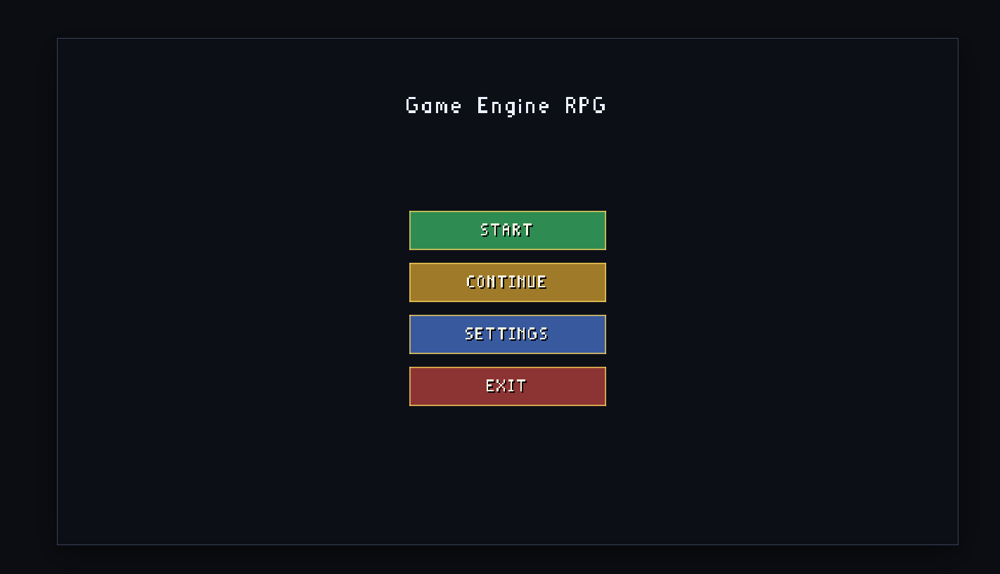
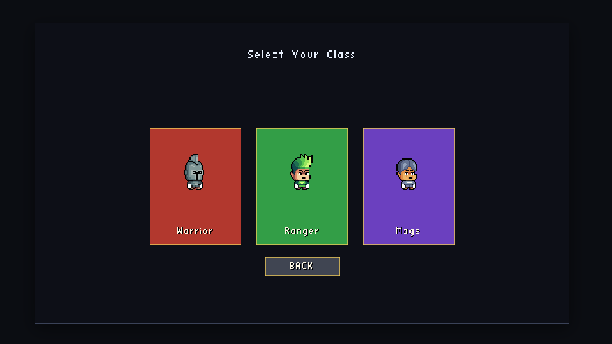
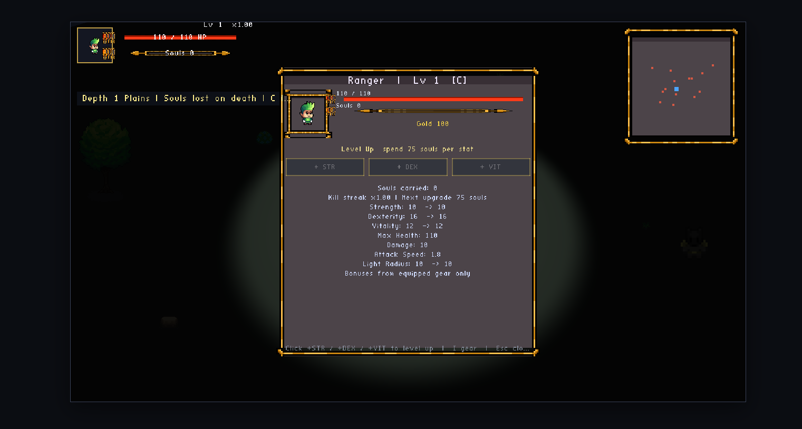

# cppGame

An isometric action RPG built in modern C++20 with OpenGL. Explore Town, venture into procedurally generated Plains, fight mobs and bosses, collect loot, upgrade gear at the blacksmith, and spend souls to level up.

The same gameplay code runs natively (Linux/WSL/Windows) and in the browser via WebGL (Emscripten).

## Screenshots

### Main Menu



### Class Select



### Character Screen



## Features

- **Front-end flow** — Main menu, class select (Warrior / Ranger / Mage), settings, pause menu
- **Two zones** — Town hub and Plains combat area with procedural scenery and mob spawns
- **Combat** — Click-to-move, target mobs, melee attacks, floating damage numbers, boss encounters
- **Progression** — Soul-based stat upgrades in Town, weapon mastery, depth scaling, loot tiers
- **Inventory & equipment** — Paper-doll UI, item stats, tooltips, blacksmith sell/forge services
- **Save / load** — Single-slot saves with Continue flow; platform-specific persistence (see below)

## Tech Stack

| Layer | Choice |
|-------|--------|
| Language | C++20 |
| Graphics | OpenGL 3.3+ Core (WebGL 2 in browser) |
| Window | GLFW 3 |
| Extensions | GLEW |
| Math | GLM |
| Build | CMake 3.20+ (Ninja) |
| Tests | Catch2 v3 |

Libraries are linked in a modular layout:

- **EngineCore** — Window, shaders, meshes, textures, sprites, UI rendering
- **EngineGameplay** — Zones, combat systems, inventory, UI layout, save I/O
- **GameEngine** — Application loop, menus, game screens

## Requirements

### Native (Linux / WSL2)

- CMake, Ninja, GCC/Clang (C++20)
- `libglfw3-dev`, `libglew-dev`, `libglm-dev`
- WSL2 with WSLg (or a Linux desktop with OpenGL)

```bash
sudo apt update
sudo apt install -y build-essential cmake ninja-build pkg-config \
  libglfw3-dev libglew-dev libglm-dev
```

### WebGL

- Emscripten SDK (bootstrapped automatically by `scripts/build-webgl.sh` into `.emsdk/`)
- Python 3 (HTTP smoke tests)

### Windows (cross-compile from Linux)

- MinGW-w64: `gcc-mingw-w64-x86-64`, `g++-mingw-w64-x86-64`, `mingw-w64-x86-64-dev`

## Quick Start (Native)

```bash
./setup_workspace.sh

cmake -S . -B build -G Ninja -DCMAKE_BUILD_TYPE=Debug
cmake --build build -j$(nproc)

./build/GameEngine
```

Or run the full validation pipeline (clean build + tests):

```bash
./validate.sh
```

Release build:

```bash
cmake -S . -B build -G Ninja -DCMAKE_BUILD_TYPE=Release
cmake --build build -j$(nproc)
```

## WebGL Build & Play

Web builds must be served over HTTP (do not open `file://` URLs).

```bash
./scripts/build-webgl.sh          # Release wasm by default
./scripts/serve-webgl.sh          # http://127.0.0.1:8081/index.html
```

Release WebGL output lands in `build-webgl/` (`GameEngine.js`, `GameEngine.wasm`, `GameEngine.data`, `index.html`).

Debug WebGL:

```bash
ENGINE_BUILD_TYPE=Debug ./scripts/build-webgl.sh
```

## Windows Build

Cross-compile from WSL/Linux:

```bash
./scripts/build-windows-x86_64.sh
```

Output: `build-win-x86_64/GameEngine.exe` with assets staged beside the executable.

## Controls

| Input | Action |
|-------|--------|
| Mouse click | Menu buttons, move, attack, interact, UI |
| **C** | Character / stat screen |
| **I** | Inventory & equipment |
| **E** | Blacksmith trade (Town, near forge) |
| **Esc** | Pause menu / close overlays |

### Pause menu

- **Save and Exit** — Saves progress and returns to the main menu
- **Settings** — Resolution, graphics quality, minimap, volume
- **Resume**

### Main menu

- **START** — New game (class select)
- **CONTINUE** — Load saved character (when a save exists)
- **SETTINGS** / **EXIT**

## Save Data

| Platform | Location |
|----------|----------|
| **WebGL** | Browser `localStorage` key `cppGame_save_v1` |
| **Windows** | `%LOCALAPPDATA%\cppGame\savegame.json` |
| **Linux** | `~/.local/share/cppGame/savegame.json` |

Saves persist across normal sessions. Clearing browser site data (hard reset) or deleting the save file removes progress.

## Testing

Native tests require a display (WSLg or X11/Wayland):

```bash
cmake --build build --target EngineTests
cd build && ctest --output-on-failure
```

Notable suites:

| Tag | Focus |
|-----|--------|
| `[boot]` | Application startup |
| `[playthrough]` | End-to-end gameplay loop |
| `[performance]` | Plains frame-time budget |
| `[save]` | Save round-trip |
| `[combat]`, `[mobs]`, `[items]` | Core systems |

Run a single suite:

```bash
ctest --test-dir build -R engine_save_suite --output-on-failure
```

## Project Layout

```
cppGame/
├── assets/           Shaders, textures, sprites, models
├── cmake/            CMake modules, WebGL shell, Windows resources
├── include/          Public headers (game/, gameplay/, systems/, render/, ui/)
├── src/              Implementations
├── tests/            Catch2 unit & integration tests
├── scripts/          Build, serve, clean, asset tooling
├── third_party/      stb_image, etc.
├── setup_workspace.sh
└── validate.sh       Clean build + test pipeline
```

## Scripts

| Script | Purpose |
|--------|---------|
| `setup_workspace.sh` | Check deps, create asset dirs |
| `validate.sh` | Clean native build + run tests |
| `scripts/build-webgl.sh` | Emscripten build + smoke tests |
| `scripts/serve-webgl.sh` | Serve `build-webgl/` on port 8081 |
| `scripts/build-windows-x86_64.sh` | Cross-compile Windows exe |
| `scripts/clean-build.sh` | Remove all `build*` directories |
| `scripts/slice_world_assets.py` | Slice sprite sheets for world assets |

## Graphics Quality

In **Settings**, cycle **Graphics Quality**:

- **Low** — Shorter render distance, no mob nameplates, lighter minimap
- **Medium** — Default balance
- **High** — Extended render distance

Use **Low** on slower hardware or in Debug WebGL builds if Plains framerate drops.

## License

See repository license file if present. Third-party headers (e.g. stb) retain their respective licenses.
