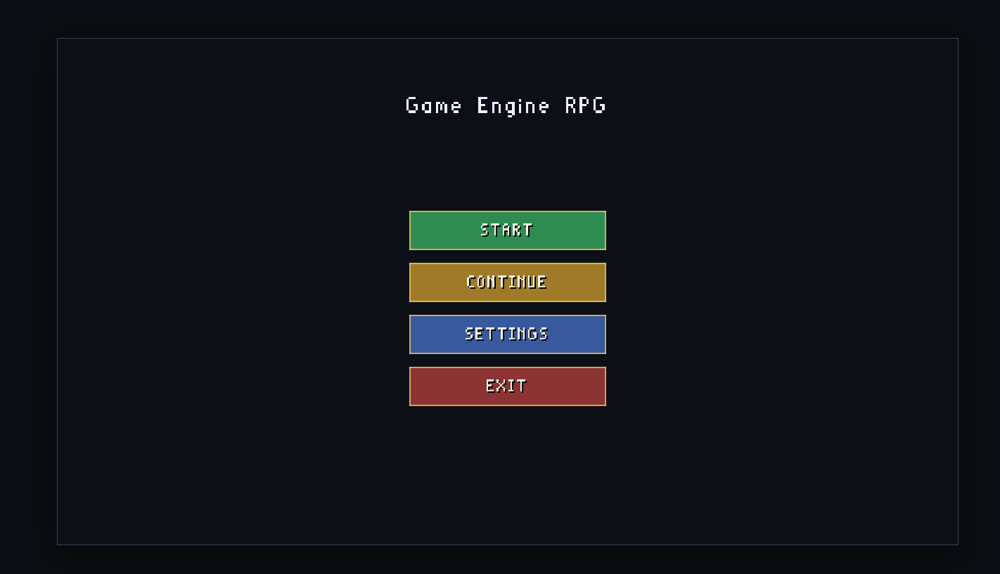
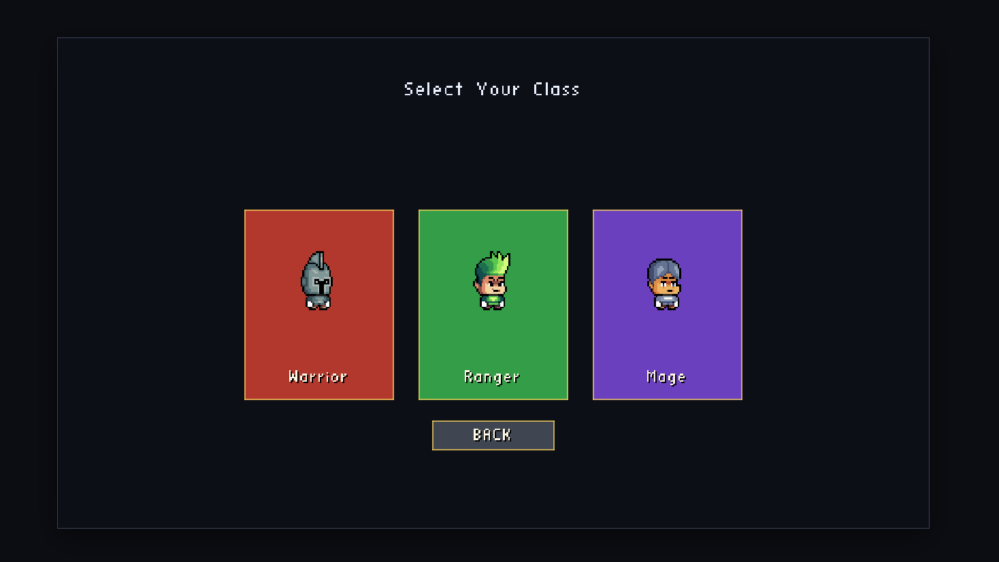
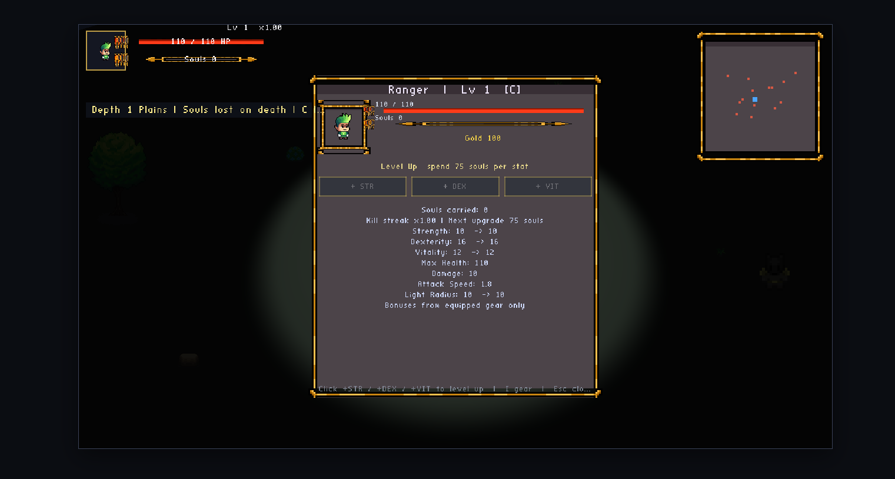

# cppGame

An isometric action RPG built in modern C++20 with OpenGL. Explore Town, venture into procedurally generated Plains, fight mobs and bosses, collect loot, upgrade gear at the blacksmith, and spend souls to level up.

The same gameplay code runs natively (Linux/WSL/Windows) and in the browser via WebGL (Emscripten).

## Screenshots

### Main Menu



### Class Select



### Character Screen



## Features

- **Front-end flow** — Main menu, class select (Warrior / Ranger / Mage), settings, pause menu
- **Two zones** — Static illustrated town (clickable ruins that gold and levels repair) and Plains combat with denser, tougher mobs
- **Combat** — Click-to-move, target mobs, melee attacks, critical hits, screen shake + hit-stop, floating damage / crit text, boss encounters
- **Skills** — Quick-cast hotkey bar (Power Strike, Whirlwind, Heal, Dash, and four more) with mana pool and cooldowns; belt potions on **Q**. **C** opens a two-panel Abilities window (spellbook + soul talent nodes)
- **Slot-machine loot** — Kills and chests spin a reel, but early drops are scarce. Rarity runs Common, Magic (blue), Rare (yellow), Legendary (brown), Unique (green). Mythical (magenta) is a tavern gamble at about 1 in 10,000, not a combat drop
- **Progression** — Soul-based stat upgrades in Town, weapon mastery, depth scaling, Normal / Nightmare / Hell difficulty tiers unlocked by boss kills
- **Dark-fantasy presentation** — Torch-lit shading with cool shadows and fog, particle system (hit sparks, death bursts, spell flashes, ambient dust), 8-way sprite facing with hit / death animation states
- **Deskrawl-style HUD** — Clustered health / mana globes, level badge, skill quick-slots with cooldown sweeps, potion count, bottom-right menu icons, XP bar, minimap overlay
- **Inventory & equipment** — Paper-doll UI, item stats, hover tooltips with stat comparison versus equipped gear, socketed items, blacksmith sell/forge services
- **Save / load** — Single-slot saves with Continue flow; platform-specific persistence (see below)

## Tech Stack

| Layer | Choice |
|-------|--------|
| Language | C++20 |
| Graphics | OpenGL 3.3+ Core (WebGL 2 in browser) |
| Window | GLFW 3 |
| Extensions | GLEW |
| Math | GLM |
| Build | CMake 3.20+ (Ninja) |
| Tests | Catch2 v3 |

Libraries are linked in a modular layout:

- **EngineCore** — Window, shaders, meshes, textures, sprites, UI rendering
- **EngineGameplay** — Zones, combat systems, inventory, UI layout, save I/O
- **GameEngine** — Application loop, menus, game screens

## Requirements

### Native (Linux / WSL2)

- CMake, Ninja, GCC/Clang (C++20)
- `libglfw3-dev`, `libglew-dev`, `libglm-dev`
- WSL2 with WSLg (or a Linux desktop with OpenGL)

```bash
sudo apt update
sudo apt install -y build-essential cmake ninja-build pkg-config \
  libglfw3-dev libglew-dev libglm-dev
```

### WebGL

- Emscripten SDK (bootstrapped automatically by `scripts/build-webgl.sh` into `.emsdk/`)
- Python 3 (HTTP smoke tests)

### Windows (cross-compile from Linux)

- MinGW-w64: `gcc-mingw-w64-x86-64`, `g++-mingw-w64-x86-64`, `mingw-w64-x86-64-dev`

## Quick Start (Native)

```bash
./setup_workspace.sh

cmake -S . -B build -G Ninja -DCMAKE_BUILD_TYPE=Debug
cmake --build build -j$(nproc)

./build/GameEngine
```

Or run the full validation pipeline (clean build + tests):

```bash
./validate.sh
```

Release build:

```bash
cmake -S . -B build -G Ninja -DCMAKE_BUILD_TYPE=Release
cmake --build build -j$(nproc)
```

## WebGL Build & Play

Web builds must be served over HTTP (do not open `file://` URLs).

```bash
./scripts/build-webgl.sh          # Release wasm by default
./scripts/serve-webgl.sh          # http://127.0.0.1:8081/index.html
```

Release WebGL output lands in `build-webgl/` (`GameEngine.js`, `GameEngine.wasm`, `GameEngine.data`, `index.html`).

Debug WebGL:

```bash
ENGINE_BUILD_TYPE=Debug ./scripts/build-webgl.sh
```

## Windows Build

Cross-compile from WSL/Linux:

```bash
./scripts/build-windows-x86_64.sh
```

Output: `build-win-x86_64/GameEngine.exe` with assets staged beside the executable.

## Controls

| Input | Action |
|-------|--------|
| Mouse click | Menu buttons, town buildings, move on the road, attack, interact, UI |
| **C** | Abilities (spells and soul talents) |
| **I** | Character paper-doll and inventory |
| Bottom-right icons | **C** abilities, **I** inventory, **M** map, **S** settings, **P** pause |
| **E** | Blacksmith trade once the forge is repaired |
| **1 – 4** | Quick-cast skill slots (Power Strike, Whirlwind, Heal, Dash) |
| **Q** | Drink first belt potion |
| **Esc** | Pause menu / close overlays |

### Town progression

Town is a static scene. The hero does not walk between buildings.

Buildings start in ruins. Click one to spend gold once your level is high enough:

| Building | Level | Gold | Unlocks |
|----------|------:|-----:|---------|
| Blacksmith | 1 | 36 | Sell gear and forge services |
| Chapel | 2 | 64 | Rest (12 gold tithe restores health and mana) |
| Tavern | 3 | 120 | Mystery gamble, 25 gold a spin |

Kills pay gold and experience directly, so the first repairs come from fighting rather than from a pile of items. **The Road** (or **M**) opens the campaign map. The circular minimap stays hidden on this scene and returns on the road and in combat. Mythical items are reserved for the tavern reel at 1/10000.

Town pictures live in `assets/textures/town/` (`backdrop.png`, ruined and repaired forge/chapel/tavern plates, `road.png`). The game loads those files. On the RTX 5080, regenerate them with the same SDXL LoRAs as the item atlases:

```bash
cd /home/dev/projects/cppGame
python3 -m venv .venv-diffusion && source .venv-diffusion/bin/activate
python -m pip install -U pip
python -m pip install -r scripts/requirements-diffusion.txt
python scripts/generate_town_sd.py --backend sdxl
```

Flux, after accepting the license and `huggingface-cli login`:

```bash
python scripts/generate_town_sd.py --backend flux --cpu-offload
```

`python scripts/generate_town_sd.py --dry-run` prints prompts without a GPU. `--placeholders` rewrites the committed pixel-art stand-ins (Pillow only) if the PNGs are missing.

### Pause menu

- **Save and Exit** — Saves progress and returns to the main menu
- **Settings** — Resolution, graphics quality, minimap, volume, difficulty tier (Normal / Nightmare / Hell)
- **Resume**

### Main menu

- **START** — New game (class select)
- **CONTINUE** — Load saved character (when a save exists)
- **SETTINGS** / **EXIT**

## Save Data

| Platform | Location |
|----------|----------|
| **WebGL** | Browser `localStorage` key `cppGame_save_v1` |
| **Windows** | `%LOCALAPPDATA%\cppGame\savegame.json` |
| **Linux** | `~/.local/share/cppGame/savegame.json` |

Saves persist across normal sessions. Clearing browser site data (hard reset) or deleting the save file removes progress.

## Testing

Native tests require a display (WSLg or X11/Wayland):

```bash
cmake --build build --target EngineTests
cd build && ctest --output-on-failure
```

Notable suites:

| Tag | Focus |
|-----|--------|
| `[boot]` | Application startup |
| `[playthrough]` | End-to-end gameplay loop |
| `[performance]` | Plains frame-time budget |
| `[save]` | Save round-trip |
| `[telemetry]` | Slot-machine loot Monte-Carlo (1,000 chests, 5,000 kills, pity cap) |
| `[arpg]` | Skill bar, combat feedback, animation states, particles, HUD console, difficulty tiers |
| `[arpg][opengl]` | In-engine ARPG playthrough: hotkeys, melee, 1,000 virtual chests |
| `[combat]`, `[mobs]`, `[items]` | Core systems |

Run a single suite:

```bash
ctest --test-dir build -R engine_save_suite --output-on-failure
```

## Project Layout

```
cppGame/
├── assets/           Shaders, textures, sprites, models
├── cmake/            CMake modules, WebGL shell, Windows resources
├── include/          Public headers (game/, gameplay/, systems/, render/, ui/)
├── src/              Implementations
├── tests/            Catch2 unit & integration tests
├── scripts/          Build, serve, clean, asset tooling
├── third_party/      stb_image, etc.
├── setup_workspace.sh
└── validate.sh       Clean build + test pipeline
```

## Scripts

| Script | Purpose |
|--------|---------|
| `setup_workspace.sh` | Check deps, create asset dirs |
| `validate.sh` | Clean native build + run tests |
| `scripts/build-webgl.sh` | Emscripten build + smoke tests |
| `scripts/serve-webgl.sh` | Serve `build-webgl/` on port 8081 |
| `scripts/build-windows-x86_64.sh` | Cross-compile Windows exe |
| `scripts/clean-build.sh` | Remove all `build*` directories |
| `scripts/slice_world_assets.py` | Slice sprite sheets for world assets |
| `scripts/generate_assets.py` | Procedural atlases (Pillow). Fallback if no GPU |
| `scripts/generate_rpg_atlases_sd.py` | SDXL or FLUX.1-dev + LoRA atlas replacement |

## Diffusion atlases (RTX 5080)

`scripts/generate_rpg_atlases_sd.py` repaints `items_atlas.png`, UI skill and menu icons, and the warrior / ranger / mage / monster sheets. It keeps the existing JSON frame and clip layout, so the game loaders do not change. Prompts are original; the sheets are not copied from another game.

This cloud environment has no CUDA, so the weights are not downloaded here. On WSL with the 5080 (`/home/dev/projects/cppGame`):

```bash
cd /home/dev/projects/cppGame
python3 -m venv .venv-diffusion
source .venv-diffusion/bin/activate
python -m pip install -U pip
python -m pip install -r scripts/requirements-diffusion.txt
python scripts/generate_rpg_atlases_sd.py --backend sdxl
```

SDXL stack (default, fits 16 GB):

| Role | Repo | Trigger | Weight |
|------|------|---------|--------|
| Base | `stabilityai/stable-diffusion-xl-base-1.0` | | |
| Game-icon LoRA | `nerijs/pixel-art-xl` (`pixel-art-xl.safetensors`) | `pixel` | 0.90 |
| RPG style LoRA | `ntc-ai/SDXL-LoRA-slider.fantasy` (`fantasy.safetensors`) | `fantasy` | 1.50 |

Flux stack (license-gated base; accept it on the model page, then `huggingface-cli login`):

| Role | Repo | Trigger | Weight |
|------|------|---------|--------|
| Base | `black-forest-labs/FLUX.1-dev` | | |
| Pixel-RPG LoRA | `AIGCDuckBoss/fluxLora_pixelRPG` (`fluxLora_pixelrpg.safetensors`) | `The overall style of the illustration is colorful pixel style` | 0.85 |

```bash
python scripts/generate_rpg_atlases_sd.py --backend flux --cpu-offload
```

`--dry-run` prints every prompt. `--check` confirms those prompts still cover `items_atlas.json` and the directional clip JSON. `--groups items` limits a run to the inventory sheet.

## Graphics Quality

In **Settings**, cycle **Graphics Quality**:

- **Low** — Shorter render distance, no mob nameplates, lighter minimap
- **Medium** — Default balance
- **High** — Extended render distance

Use **Low** on slower hardware or in Debug WebGL builds if Plains framerate drops.

## License

See repository license file if present. Third-party headers (e.g. stb) retain their respective licenses.
